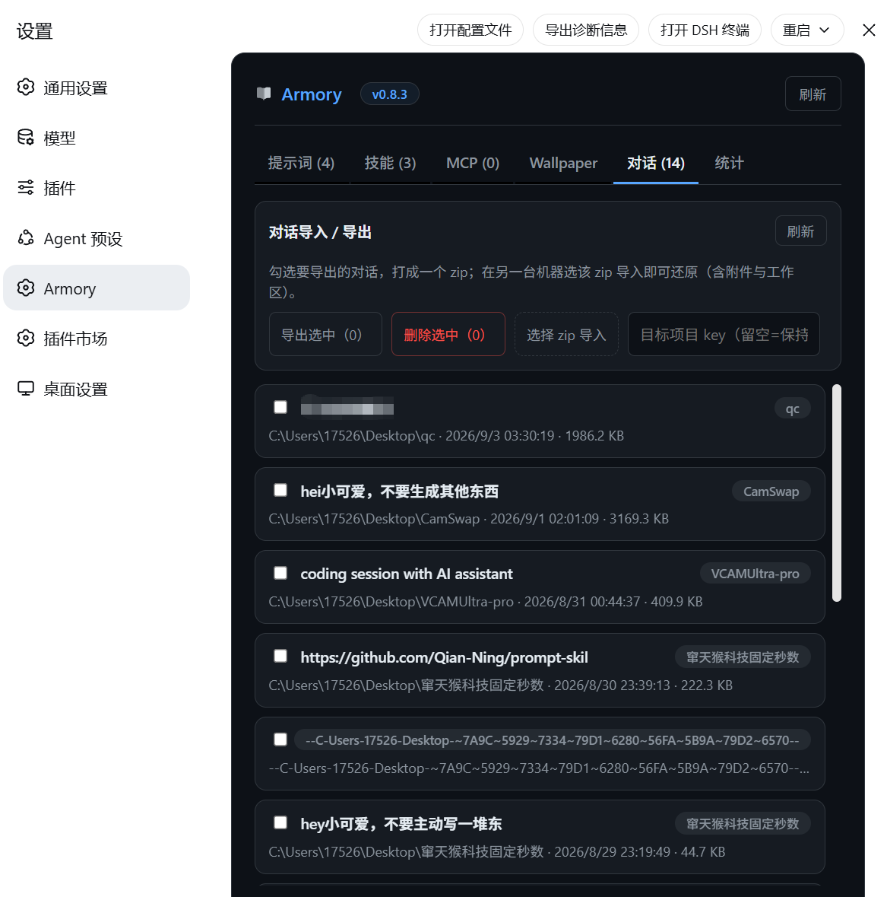
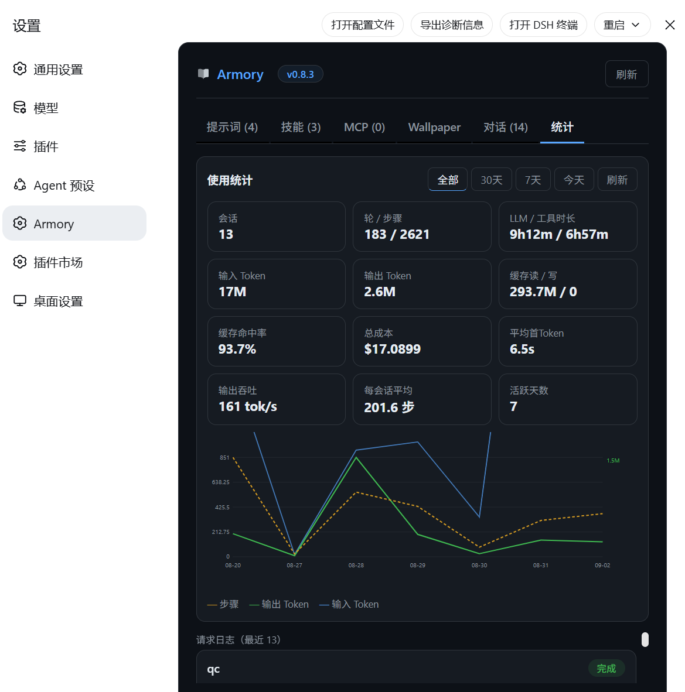

# Armory

> **A community plugin / control center for DeepSeek Harness** — prompts, skills, MCP tool servers, agent presets, and a global wallpaper with effects, all in one management panel.

**Package / repo**: `prompt-skill-armory` · [GitHub](https://github.com/Qian-Ning/prompt-skill-armory)

[**中文**](./README.md) · **English**


|  |  |  |  |
|--|--|--|--|
|  |  | | |


```
✦ Armory  v0.9.0
┌─────────┬─────────┬─────┬────────────┬──────┬──────┐
│ Prompts │ Skills  │ MCP │  Wallpaper │ Chat │ Stats│
│ global  │ merged  │ hub │  wallpaper │ sync │ usage│
└─────────┴─────────┴─────┴────────────┴──────┴──────┘
```

---

## 📑 Table of contents

- [🚀 Quick start](#-quick-start)
- [✨ Features](#-features)
- [🖥️ Platform support](#️-platform-support)
- [🔄 One-click update](#-one-click-update)
- [🗑️ Uninstall](#️-uninstall)
- [🏗️ Architecture](#️-architecture)
- [📦 Packages](#-packages)
- [🗂️ Repository layout](#️-repository-layout)
- [🛠️ Development](#️-development)
- [❓ FAQ](#-faq)
- [📚 Docs](#-docs)
- [🤝 Contributing / Upstream](#-contributing--upstream)
- [📄 License](#-license)
- [🔗 Friends](#-friends)

---

## 🚀 Quick start

### Install

```bash
npx prompt-skill-armory
```

Uninstall:

```bash
npx prompt-skill-armory uninstall
```

The installer automatically:

1. Locates the DSH home
2. Ensures `web` + `desktop` profiles exist
3. Installs both plugin packages (Host + Web panel)
4. Configures the Host bundle
5. Mounts the panel (profile `cordis.patch.yml`)
6. Health-checks settings (prevents 4MB bloat)

### Launch

```bash
cd deepseek-harness
pnpm run build
pnpm dsh web
```

(Or simply relaunch the DSH Desktop client.)

Open **Settings → Armory** (book icon).

> **Requirement**: a DeepSeek Harness runtime (`dsh web` or desktop client) must already be installed — this is a DSH plugin and does not bundle the runtime.

---

## ✨ Features

- **Prompts (global)** — CRUD, enable/disable, set default. Enabled prompts are injected into every agent's system prompt via `ctx.systemPrompt.section`.
- **Skills (merged)** — one list: panel-installed (edit/toggle/uninstall) + locally scanned (managed), with an invoke hint (`/name`).
- **Skill installation** — manual entry, `.md` file picker, or in-chat commands `/armory-skill-dir <dir>` and `/armory-install-zip <zip>`.
- **MCP tool servers** — add/edit/remove stdio or HTTP(S) servers; enabling auto-connects them with per-server status, a live tool list, and a one-click connect test.
- **Wallpaper (global background & effects)** — upload a local image/video (bytes on disk, id-only in settings) or paste an image URL; tune opacity/scrim/glass/blur/fit live; **set separately on web vs desktop**.
- **Composer hint-line style** — enable/color/size/gradient presets for the below-input hint and stats line.
- **Conversation import / export** — export selected sessions as a zip (attachments + workspace included) and restore them on another machine; the list shows title, project and time; **real delete** (removes the session directory + index entry).
- **Usage stats (cc-switch style)** — range filter (all / 30d / 7d / today); input / output / cache-read / cache-write tokens, cache-hit rate, cost estimate; request log (time / project / in-out / cache / cost / latency / first-token / status); provider (project) stats and model stats; SVG dual-axis trend chart (24h split for today).
- **Bilingual UI** (简体中文 / English).
- **Settings sidebar book icon**.

## 🖥️ Platform support

| Environment | Panel | `/armory` commands |
|---|---|---|
| `dsh web` (official) | ✅ | ✅ |
| DSH Desktop client | ✅ | ✅ |

Achieved via profile composition (the installer mounts the panel into each profile's `cordis.patch.yml`) — no client fork needed.

## 🔄 One-click update

Every time the panel opens it queries npm for the latest `prompt-skill-armory` version; when a newer version exists a banner appears:

> New version vX.Y.Z (current v0.9.0) [Update now]

Clicking "Update now" makes the Host re-run the official installer in place → "Update complete, please restart the client".

## 🗑️ Uninstall

```bash
npx prompt-skill-armory uninstall
```

Removes both plugin packages, the Host bundle, the panel mount, and cleans up wallpaper/export dirs (prompts/skills settings remain in `settings.yaml`; delete the `switchblade` namespace manually for a full wipe).

## 🧰 Using a skill in chat

Type `/` + skill name in the input:

```
/code-review
/mission-keeper
```

The skill body is injected and the agent executes it; `modelInvocable` skills can also be called autonomously by the model.

## 🏗️ Architecture

```
┌──────────────────────────────────────────────────────┐
│                    DSH Runtime                       │
│                                                      │
│  ┌─────────────┐   RPC/connection   ┌─────────────┐  │
│  │  Web panel   │◄──────────────────►│  Host svc    │  │
│  │ ui-switchblade│   api.skills.*    │ switchblade │  │
│  │  (settings)  │   api.settings.*  │  (bundle)   │  │
│  │             │   /api/armory/*    │  + routes   │  │
│  └─────────────┘                    └──────┬──────┘  │
│                                            │         │
│                              ctx.systemPrompt.section│
│                              ctx.skills.register     │
│                              /api/armory/* (convers. │
│                              stats / wallpaper /     │
│                              update / uninstall)     │
└──────────────────────────────────────────────────────┘
```

- **Host service** (`switchblade` bundle) owns prompt/skill/preset CRUD and persistence, global injection via `ctx.systemPrompt.section`, and skill registration via `ctx.skills.register`; it also serves `/api/armory/*` routes (conversation import/export, session delete, usage stats, wallpaper upload, version check, one-click update).
- **Web panel** (`ui-switchblade`) talks to the Host via connection RPC (`api.skills.list`, `api.settings.mutate/describe`) and `/api/armory/*` routes — never touching DSH internals directly.
- **Installer** composes both into DSH via profiles — web and desktop share the same mechanism.

## 📦 Packages

| Package | Purpose |
|---|---|
| `prompt-skill-armory` | npm installer CLI (with uninstall) |
| `@deepseek-ai/dsh-switchblade` | Host service (prompts/skills/commands/MCP/wallpaper/conversations/stats + routes) |
| `@deepseek-ai/dsh-client-ui-switchblade` | Web panel (six tabs: prompts/skills/MCP/wallpaper/chat/stats) |

## 🗂️ Repository layout

```
prompt-skill-armory/
├── cli.cjs                  # one-command install/uninstall CLI
├── package.json             # npm installer package
├── packages/                # built plugins (lib+src+manifest)
│   ├── switchblade/         # @deepseek-ai/dsh-switchblade (Host)
│   └── client-ui-switchblade/ # @deepseek-ai/dsh-client-ui-switchblade (Web)
├── plugin-src/              # plugin source mirror
├── scripts/build-shipped.mjs # sync build outputs from a DSH checkout
├── demo/demo.html           # UI preview (mock data)
├── docs/preview/            # real panel screenshots
├── README.md                # this file (zh) · README.en.md (en)
├── UPSTREAM.md              # upstream integration guide
├── CHANGELOG.md             # version history
├── PUBLISHING.md            # release guide
├── TESTING.md               # testing guide
├── LICENSE                  # MIT
└── .github/workflows/ci.yml # CI quality gate
```

## 🛠️ Development

After editing source, rebuild the shipped package:

```bash
node scripts/build-shipped.mjs <path-to-deepseek-harness>
```

Keep three places in sync on version bumps:

1. `packages/*/package.json` `version`
2. `ARMORY_VERSION` (panel constant)
3. `CHANGELOG.md`

Then rebuild the client bundle so the version badge updates.

## ❓ FAQ

**Q: Why is my client sidebar icon a gear instead of a book?**
A: The desktop client's packaged `SettingsRoot` hard-codes its icon map. The npm installer's profile composition works fine, but the book icon needs an upstream merge (see [`UPSTREAM.md`](./UPSTREAM.md)).

**Q: Imported conversations don't show on the other machine?**
A: Restart the DSH client after import so it rescans the session list. If the target project path differs, fill in the "target project key" (e.g. `--C-Users-xxx--`) before importing so sessions land in the right project.

**Q: Is the cost in stats accurate?**
A: The cost is an **estimate** (built-in per-token pricing: input $0.3/M, output $1.2/M, cache-read $0.03/M, cache-write $0.6/M), not a real bill.

**Q: Does this affect my existing config / sessions?**
A: No. The plugin only adds the `switchblade` settings namespace and leaves other config untouched. The installer also health-checks settings against bloat.

**Q: Offline install?**
A: Yes — copy the npm tarball to the target machine and `npm install <tarball>`, or install the local build via `file:` (see [`TESTING.md`](./TESTING.md)).

**Q: Where do skills come from?**
A: Three ways: manual entry, `.md` file picker, or in-chat `/armory-skill-dir` (directory) / `/armory-install-zip` (zip). Once installed they all appear in the Skills tab.

## 📚 Docs

| Doc | Purpose |
|---|---|
| [`README.en.md`](./README.en.md) | English readme |
| [`TESTING.md`](./TESTING.md) | local functional tests (no publish needed) |
| [`PUBLISHING.md`](./PUBLISHING.md) | release guide |
| [`UPSTREAM.md`](./UPSTREAM.md) | upstream integration (book-icon PR) |
| [`CHANGELOG.md`](./CHANGELOG.md) | full version history |

## 🤝 Contributing / Upstream

See [`UPSTREAM.md`](./UPSTREAM.md) — how to get the panel natively into `deepseek-ai/deepseek-harness` and `anywhere-labs/dsh-desktop` (book icon in the client sidebar).

## 📄 License

MIT

## 🔗 Friends

- [**LINUX DO**](https://linux.do/) — tech community · LINUX DO 社区
